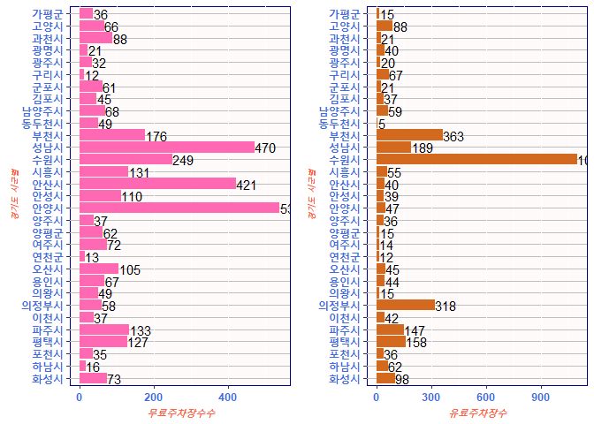

경기도 주차장수
================
2023-09-01

## 패키지 불러오기기

``` r
library(dplyr)
```

    ## 
    ## 다음의 패키지를 부착합니다: 'dplyr'

    ## The following objects are masked from 'package:stats':
    ## 
    ##     filter, lag

    ## The following objects are masked from 'package:base':
    ## 
    ##     intersect, setdiff, setequal, union

``` r
library(ggplot2)
df_test <- read.csv("ggpark2.csv",fileEncoding = "euc-kr") # pandas에서 내보냈던 데이터셋
df_test
```

    ##    남부_북부   시군별 X2019_노상.유료. X2019_노상.무료. X2019_노외.공영.
    ## 1       남부   수원시              831              170               68
    ## 2       남부   성남시              153              207              259
    ## 3       남부   안양시               26              455               81
    ## 4       남부   부천시              288                0              131
    ## 5       남부   광명시                9                2               20
    ## 6       남부   평택시               12               59               76
    ## 7       남부   안산시               17              198              243
    ## 8       남부   과천시               20                7               77
    ## 9       남부   오산시                2               59               40
    ## 10      남부   시흥시                9               15               79
    ## 11      남부   군포시                4               14               48
    ## 12      남부   의왕시                4               38               22
    ## 13      남부   하남시               13                7                7
    ## 14      남부   용인시                6               36               35
    ## 15      남부   이천시               35               59               14
    ## 16      남부   안성시                5               76               25
    ## 17      남부   김포시                7                5               43
    ## 18      남부   화성시                7               26               40
    ## 19      남부   광주시                0               15               19
    ## 20      남부   여주시               14               47               24
    ## 21      남부   양평군               16               29               25
    ## 22      북부 의정부시                0               14               40
    ## 23      북부 동두천시                0               24               21
    ## 24      북부   고양시                6               10               49
    ## 25      북부   구리시                9                3                7
    ## 26      북부 남양주시               12               26               35
    ## 27      북부   파주시               24               55               73
    ## 28      북부   양주시                2                5               28
    ## 29      북부   포천시               10                5               31
    ## 30      북부   연천군               12                5                7
    ## 31      북부   가평군                7                0               23
    ##    X2019_노외.민영. X2020_노상.유료. X2020_노상.무료. X2020_노외.공영.
    ## 1               180              812              163               79
    ## 2                59              145              223              262
    ## 3                22               26              455               73
    ## 4                57              295                0              136
    ## 5                32                9                2               18
    ## 6               144               12               54               65
    ## 7                22               17              198              175
    ## 8                 0               20                7               77
    ## 9                39                2               59               42
    ## 10               55                9               15              104
    ## 11               12                4               14               48
    ## 12                9                3               36               21
    ## 13               22               10                6               10
    ## 14               16                7               36               12
    ## 15               31               35               59               14
    ## 16               26                5               76               31
    ## 17               30                9                4               36
    ## 18               84               13               21               46
    ## 19                8                4               11               19
    ## 20                0               14               48               19
    ## 21                5               16               29               26
    ## 22               63              224               57               40
    ## 23                5                0               24               23
    ## 24               79                6               10               51
    ## 25                2                9                3                7
    ## 26               76                7               30               43
    ## 27              124               24               56               72
    ## 28               31                2                6               30
    ## 29               24               10                5               31
    ## 30                0               12                5                7
    ## 31                0               11                4               29
    ##    X2020_노외.민영. X2021_노상.유료. X2021_노상.무료. X2021_노외.공영.
    ## 1               186              865              170               79
    ## 2                54              143              183              287
    ## 3                22               25              464               75
    ## 4                58              303                6              170
    ## 5                31                9                2               19
    ## 6               146               11               59               68
    ## 7                23               17              188              233
    ## 8                 3               20                9               79
    ## 9                39                2               62               43
    ## 10               46                9               17              114
    ## 11               15                4               14               47
    ## 12               11                3               29               20
    ## 13               52               10                5               11
    ## 14                0                6               36               31
    ## 15               31               11               19               18
    ## 16               27                5               76               34
    ## 17               28                9                5               40
    ## 18               82               16               23               50
    ## 19               11                6               12               20
    ## 20                0               14               48               24
    ## 21                5               13               38               24
    ## 22               62              258               12               46
    ## 23                5                0               24               25
    ## 24               81                7               10               56
    ## 25                2                8                3                9
    ## 26               53                7               27               41
    ## 27              248               22               53               80
    ## 28               31                2                6               31
    ## 29               25               10                5               30
    ## 30                0               12                5                8
    ## 31                3               14                0               36
    ##    X2021_노외.민영.
    ## 1               233
    ## 2                46
    ## 3                22
    ## 4                60
    ## 5                31
    ## 6               147
    ## 7                23
    ## 8                 1
    ## 9                43
    ## 10               46
    ## 11               17
    ## 12               12
    ## 13               52
    ## 14               38
    ## 15               31
    ## 16               34
    ## 17               28
    ## 18               82
    ## 19               14
    ## 20                0
    ## 21                2
    ## 22               60
    ## 23                5
    ## 24               81
    ## 25               59
    ## 26               52
    ## 27              125
    ## 28               34
    ## 29               26
    ## 30                0
    ## 31                1

## 테마생성

``` r
# ggplot 테마 생성
mytheme <-theme(plot.title=element_text(face="bold.italic",
                                        size=14,
                                        color="brown")) + # 그래프의 테마 변경
  theme(axis.title=element_text(face="bold.italic",
                                size=10,
                                color="tomato")) +
  theme(axis.text=element_text(face="bold",
                               size=9,
                               color="royalblue"),
        panel.background = element_rect(fill="snow",color="darkblue"),
        panel.grid.major.y = element_line(color="gray",linetype="solid"),
        panel.grid.minor.y = element_line(color="gray",linetype="dashed"),
        legend.position = "inside")
```

## 전처리 와 알맞는 변수 생성성

``` r
# 시군별로 주차장수 종류별 주차장 수와 그의 합계 total 변수 생성
df_4<- df_test %>%
  group_by(시군별) %>%
  select(X2021_노상.유료.,X2021_노상.무료.,X2021_노외.공영.,X2021_노외.민영.) %>%
  mutate(total = X2021_노상.유료.+ X2021_노상.무료.+X2021_노외.공영.+X2021_노외.민영.)
```

    ## Adding missing grouping variables: `시군별`

``` r
df_4
```

    ## # A tibble: 31 × 6
    ## # Groups:   시군별 [31]
    ##    시군별 X2021_노상.유료. X2021_노상.무료. X2021_노외.공영. X2021_노외.민영.
    ##    <chr>             <int>            <int>            <int>            <int>
    ##  1 수원시              865              170               79              233
    ##  2 성남시              143              183              287               46
    ##  3 안양시               25              464               75               22
    ##  4 부천시              303                6              170               60
    ##  5 광명시                9                2               19               31
    ##  6 평택시               11               59               68              147
    ##  7 안산시               17              188              233               23
    ##  8 과천시               20                9               79                1
    ##  9 오산시                2               62               43               43
    ## 10 시흥시                9               17              114               46
    ## # ℹ 21 more rows
    ## # ℹ 1 more variable: total <int>

``` r
# 무료주차장,유료주차장 변수 생성과, 시군별 factor로 변경, 비율변수 생성
df_5 <- df_4 %>%
  mutate(pay = X2021_노상.유료.+ X2021_노외.민영.) %>%
  mutate(free = X2021_노상.무료.+ X2021_노외.공영.) %>%
  mutate(city=as.factor(시군별)) %>%
  mutate(rate_free=(free/(total)*100)) %>%
  mutate(rate_pay=(pay/(total)*100)) %>%
  arrange(city) %>%
  select(free,rate_free,pay,rate_pay,total,city)
```

    ## Adding missing grouping variables: `시군별`

``` r
df_5
```

    ## # A tibble: 31 × 7
    ## # Groups:   시군별 [31]
    ##    시군별    free rate_free   pay rate_pay total city    
    ##    <chr>    <int>     <dbl> <int>    <dbl> <int> <fct>   
    ##  1 가평군      36      70.6    15    29.4     51 가평군  
    ##  2 고양시      66      42.9    88    57.1    154 고양시  
    ##  3 과천시      88      80.7    21    19.3    109 과천시  
    ##  4 광명시      21      34.4    40    65.6     61 광명시  
    ##  5 광주시      32      61.5    20    38.5     52 광주시  
    ##  6 구리시      12      15.2    67    84.8     79 구리시  
    ##  7 군포시      61      74.4    21    25.6     82 군포시  
    ##  8 김포시      45      54.9    37    45.1     82 김포시  
    ##  9 남양주시    68      53.5    59    46.5    127 남양주시
    ## 10 동두천시    49      90.7     5     9.26    54 동두천시
    ## # ℹ 21 more rows

``` r
head(df_5)
```

    ## # A tibble: 6 × 7
    ## # Groups:   시군별 [6]
    ##   시군별  free rate_free   pay rate_pay total city  
    ##   <chr>  <int>     <dbl> <int>    <dbl> <int> <fct> 
    ## 1 가평군    36      70.6    15     29.4    51 가평군
    ## 2 고양시    66      42.9    88     57.1   154 고양시
    ## 3 과천시    88      80.7    21     19.3   109 과천시
    ## 4 광명시    21      34.4    40     65.6    61 광명시
    ## 5 광주시    32      61.5    20     38.5    52 광주시
    ## 6 구리시    12      15.2    67     84.8    79 구리시

``` r
# 남부_북부로 그룹화와 필요한 변수만 select
df_6 <- df_test %>%
  group_by(남부_북부) %>%
  mutate(pay = X2021_노상.유료.+ X2021_노외.민영.) %>%
  mutate(free = X2021_노상.무료.+ X2021_노외.공영.) %>%
  select(pay,free,시군별)
```

    ## Adding missing grouping variables: `남부_북부`

``` r
df_6
```

    ## # A tibble: 31 × 4
    ## # Groups:   남부_북부 [2]
    ##    남부_북부   pay  free 시군별
    ##    <chr>     <int> <int> <chr> 
    ##  1 남부       1098   249 수원시
    ##  2 남부        189   470 성남시
    ##  3 남부         47   539 안양시
    ##  4 남부        363   176 부천시
    ##  5 남부         40    21 광명시
    ##  6 남부        158   127 평택시
    ##  7 남부         40   421 안산시
    ##  8 남부         21    88 과천시
    ##  9 남부         45   105 오산시
    ## 10 남부         55   131 시흥시
    ## # ℹ 21 more rows

``` r
value <- rev(as.numeric(rownames(df_5['city']))) # 가평군이 맨위에 출력되게
value
```

    ##  [1] 31 30 29 28 27 26 25 24 23 22 21 20 19 18 17 16 15 14 13 12 11 10  9  8  7
    ## [26]  6  5  4  3  2  1

## p1 경기도 시군별 무료주차장 수 막대 그래프

``` r
p1 <- df_5 %>%
  ggplot(aes(x=reorder(city,value),y=free)) +
  geom_col(fill="hotpink") +
  geom_text(aes(label = free), hjust = 0, nudge_y=1) +
  coord_flip() +
  labs(x = "경기도 시군별", y = "무료주차장수수")+
  mytheme
```

## p2 경기도 시군별 유료 주차장 수 막대 그래프

``` r
p2 <- df_5 %>%
  ggplot(aes(x=reorder(city,value),y=pay)) +
  geom_col(fill="chocolate") +
  coord_flip() +
  geom_text(aes(label = pay), hjust = 0, nudge_y=1) +
  labs(x = "경기도 시군별", y = "유료주차장수") +
  mytheme
```

## p3 경기도 무료 주차장 남부/북부 수의 분포

``` r
p3 <- df_6 %>%
  ggplot(aes(x=남부_북부,y=free)) +
  geom_boxplot(fill="aliceblue") +
  labs(x = "경기도 남부/북부 ", y = "무료주차장수") +
  mytheme
```

## p4 경기도 유료 주차장 남부/북부 수의 분포

``` r
p4 <- df_6 %>%
  ggplot(aes(x=남부_북부,y=pay)) +
  geom_boxplot(fill="coral4") +
  labs(x = "경기도 남부/북부 ", y = "유료주차장 수") +
  mytheme
```

## 4분할 화면으로 위의 4개 그래프 출력력

``` r
library(gridExtra)
```

    ## 
    ## 다음의 패키지를 부착합니다: 'gridExtra'

    ## The following object is masked from 'package:dplyr':
    ## 
    ##     combine

``` r
grid.arrange(p1,p2,p3,p4,nrow=2, ncol=2)
```

<!-- -->

## 비율 그래프 -\> 유료 주차장이 더 많을때 빨간 그래포가 같이 표시됨

``` r
p5 <- ggplot(df_5, aes(x=reorder(city,value))) +
  geom_col(aes(y=rate_pay,fill="rate_pay"))+
  geom_col(aes(y=rate_free,fill="rate_free"))+
  coord_flip() +
  theme(legend.position = "top") +
  scale_fill_manual(values = c("lightblue", "lightcoral"))

p5
```

<!-- -->
